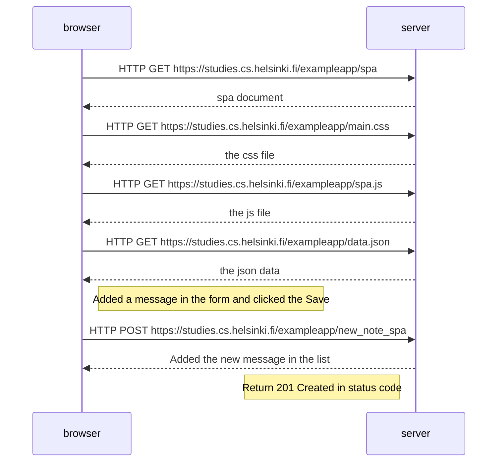

```mermaid
sequenceDiagram
    participant browser
    participant server

    browser->>server: HTTP GET https://studies.cs.helsinki.fi/exampleapp/spa
    server-->>browser: spa document

    browser->>server: HTTP GET https://studies.cs.helsinki.fi/exampleapp/main.css
    server-->>browser: the css file

    browser->>server: HTTP GET https://studies.cs.helsinki.fi/exampleapp/spa.js
    server-->>browser: the js file

    browser->>server: HTTP GET https://studies.cs.helsinki.fi/exampleapp/data.json
    server-->>browser: the json data

    Note right of browser: Added a message in the form and clicked the Save

    browser->>server: HTTP POST https://studies.cs.helsinki.fi/exampleapp/new_note_spa
    server-->>browser: Added the new message in the list

    Note left of server: Return 201 Created in status code 

```